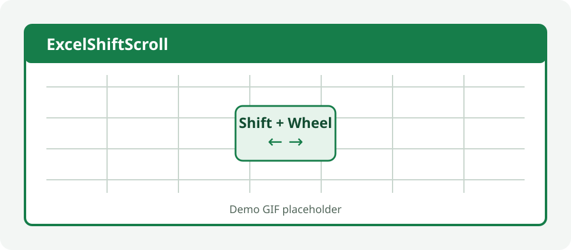

# ExcelShiftScroll

[](https://github.com/Xebet/ExcelShiftScroll/actions/workflows/build-release.yml)
[](LICENSE)

ExcelShiftScroll adds the Windows-standard **Shift + mouse wheel** gesture to desktop Microsoft Excel:

- Shift + wheel up scrolls left.
- Shift + wheel down scrolls right.
- It is enabled by default and scrolls three columns per wheel detent.

[简体中文](README.zh-CN.md)



> A real demonstration GIF will replace this placeholder after the compatibility test matrix is recorded.

## What it preserves

Normal wheel input still scrolls vertically. Ctrl + wheel still zooms. Ctrl + Shift + wheel remains Excel's native behavior. Alt/Windows-key combinations, native horizontal wheel events, non-Excel applications, Ribbon/formula-bar/task-pane/dialog/VBA-editor regions, and background Excel windows are not converted.

The add-in has no external process, no network access, no telemetry, and no workbook-content access.

## Supported systems

Primary target: Windows 11, 64-bit Microsoft 365 desktop Excel. The build also produces a 32-bit XLL and is designed for Windows 10 and Excel 2019, 2021, and 2024. Excel for the web, macOS, and mobile are not supported. See [compatibility notes](docs/compatibility.md) for verified and pending combinations.

## Download

Download the ZIP matching your Excel bitness from [GitHub Releases](https://github.com/Xebet/ExcelShiftScroll/releases/latest), then verify it against `SHA256SUMS.txt`.

To check Excel bitness: open **File → Account → About Excel**. The first line says either 32-bit or 64-bit. Windows bitness is not a substitute; a 64-bit Windows installation can run 32-bit Excel.

## Install

1. Exit every Excel process.
2. Extract the downloaded ZIP to a stable local folder such as `%LocalAppData%\ExcelShiftScroll`.
3. Right-click the `.xll`, choose **Properties**, select **Unblock** if that option appears, and choose **OK**. Files carrying the Mark-of-the-Web may otherwise be blocked by Office.
4. Start Excel and open **File → Options → Add-ins**.
5. At the bottom, select **Excel Add-ins**, choose **Go**, then **Browse**.
6. Select `ExcelShiftScroll64.xll` for 64-bit Excel or `ExcelShiftScroll32.xll` for 32-bit Excel.
7. Place the pointer over the worksheet grid, hold Shift, and turn the vertical wheel.

No administrator rights or separate .NET runtime installation is required. The release is currently unsigned, so Windows SmartScreen or Office may show a publisher warning. Do not disable security features; use the repository Release page, unblock only the file you verified, and compare its SHA-256.

## Controls

Open Excel's **Add-ins** Ribbon tab and use the **Shift Scroll** group:

- enable or pause conversion immediately;
- choose 1, 2, 3, 5, or 10 columns per detent;
- reverse direction;
- restore defaults;
- show version and runtime status.

Settings are per-user at `%LocalAppData%\ExcelShiftScroll\settings.json`; they are never stored in a workbook.

## Uninstall

1. In Excel, open **File → Options → Add-ins**.
2. Select **Excel Add-ins**, choose **Go**, and clear ExcelShiftScroll.
3. Exit every Excel process. The in-process hook is removed during add-in shutdown; there is no background process.
4. Delete the extracted release folder. Optionally delete `%LocalAppData%\ExcelShiftScroll` to remove settings and opt-in diagnostics.

## Troubleshooting

- **“Not a valid add-in”** usually means XLL bitness does not match Excel. Recheck **About Excel**.
- **Excel blocked the file**: exit Excel, use the file's **Properties → Unblock**, then retry. Do not weaken Trust Center globally.
- **Ribbon group missing**: check **File → Options → Add-ins → Disabled Items**. Ribbon callback failures can cause Office to disable a COM helper.
- **No horizontal scroll**: ensure the pointer is over the worksheet grid, only Shift is pressed, the add-in is enabled, and the sheet has horizontally scrollable columns.
- **No action over formula bar/Ribbon/dialog/task pane** is intentional.
- **Corporate policy blocks XLL files**: ask the administrator to approve the verified file or deploy a signed build. This project does not bypass policy.
- **Need diagnostics**: edit `diagnosticsEnabled` to `true` in the settings file while Excel is closed. Logs contain only timestamps, fixed event names, and exception types. Re-disable it after diagnosis.

If Excel disables the add-in after a crash, preserve the Windows/Excel version, XLL bitness, and sanitized diagnostics, then open an issue. Never upload a sensitive workbook.

## Build from source

Requirements: Windows, .NET 8 SDK (used as the build SDK), and PowerShell. The add-in itself targets .NET Framework 4.8, which ships with supported Windows versions.

```powershell
dotnet restore ExcelShiftScroll.sln --configfile NuGet.Config
dotnet build ExcelShiftScroll.sln --configuration Release --no-restore
dotnet test ExcelShiftScroll.sln --configuration Release --no-build --no-restore
./build/Package-Release.ps1 -Version 0.1.0
```

Packed XLLs are produced under `src/ExcelShiftScroll/bin/Release/net48/publish`. Release ZIPs and hashes are produced under `artifacts/release`. CI repeats these steps on a Windows runner and publishes tag builds matching `v*`.

See [architecture](docs/architecture.md), [testing](docs/testing.md), and the [ADRs](docs/adr/) for design evidence.

## Privacy and security

ExcelShiftScroll is offline. It does not read workbook names, paths, formulas, values, selections, or VBA; record keyboard characters, pointer locations, or wheel history; send telemetry; download or execute code; change Trust Center; or install a service. The thread-scoped mouse hook exists only inside the hosting Excel process and is unhooked on shutdown. See [SECURITY.md](SECURITY.md).

## Acknowledgements and clean-room development

[OfficeScroll](https://github.com/T800G/OfficeScroll) is acknowledged as a related historical project and a user-experience/compatibility reference. ExcelShiftScroll is an independent clean-room implementation. No OfficeScroll CPOL source, binary, resource, translation, decompilation output, or line-by-line rewrite was used. See the [clean-room record](docs/clean-room.md).

## Dependencies and licenses

The runtime uses Excel-DNA 1.9.0 under the zlib license. Build/test dependencies and notices are listed in [THIRD_PARTY_NOTICES.md](THIRD_PARTY_NOTICES.md). ExcelShiftScroll source is licensed under [MIT](LICENSE).
