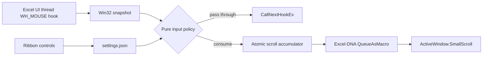

# Architecture

## Design goals

ExcelShiftScroll must alter only Shift + vertical-wheel input over an Excel worksheet, preserve every unrelated event, perform no slow work in a hook callback, and leave no process or hook after Excel exits.

## Components

- `Interop/NativeMethods` is the only P/Invoke boundary. It contains no policy.
- `Input/ExcelMouseHook` installs `WH_MOUSE` against the current Excel UI thread. The delegate is strongly referenced for the full hook lifetime. Callback exceptions pass the event through.
- `Input/WorksheetRegionDetector` requires the foreground and hit-tested windows to belong to the current process, share the same foreground root, and contain an `EXCEL7` ancestor. Unknown classes fail closed.
- `Input/InputDecisionEngine` is independent of Win32 and Excel COM. It accepts immutable snapshots, requires Shift alone, accumulates high-resolution deltas, and returns a signed column count.
- `Excel/ScrollDispatcher` coalesces fast events and submits at most one outstanding macro. Disposal drops pending work.
- `Excel/ExcelWindowScroller` runs only from a queued Excel macro and calls `ActiveWindow.SmallScroll(Down, Up, ToRight, ToLeft)`. It does not retain COM objects or call `ReleaseComObject`, matching Excel-DNA guidance for main-thread COM access.
- `Settings` stores validated per-user JSON. Corrupt or unreadable data returns defaults.
- `Ribbon` exposes enabled state, column count, reversal, reset, and About status.
- `Diagnostics` writes privacy-limited JSON lines only when explicitly enabled. The hook callback never writes to disk.

## Event policy

The event is consumed only when all predicates are true:

1. message is `WM_MOUSEWHEEL`, never `WM_MOUSEHWHEEL`;
2. settings are enabled;
3. modifiers equal Shift exactly;
4. Excel's current process owns the foreground root;
5. the pointer hit resolves to the same foreground root;
6. the hit window ancestry contains the worksheet class.

Partial precision-wheel deltas are consumed and accumulated until 120 units form one detent. Direction is negative columns for wheel-up by default (left), positive for wheel-down (right). The reverse option negates this result.

## Lifecycle and failure behavior

`IExcelAddIn.AutoOpen` constructs one service graph and installs one hook. Initialization is idempotent. `AutoClose` unhooks first and disposes pending dispatch. `HookLifetime` makes repeated install/dispose calls safe. An installation failure leaves the add-in loaded but inactive; input remains native and About reports the failure.

Excel-DNA's macro queue waits until Excel is ready and retries when editing prevents macro execution. COM failures, modal states, and shutdown races are caught outside the hook and result in a dropped scroll gesture rather than a hung or crashed Excel process.

## CPU, processes, and DPI

There is no polling, busy wait, timer owned by this project, keyboard hook, worker process, or service. Idle CPU usage is therefore event-driven and expected to be indistinguishable from zero. Win32 mouse points are screen-space physical coordinates and are passed directly to `WindowFromPoint`, avoiding custom DPI conversions. Multi-monitor handling relies on Win32's signed point fields.

## Known assumptions

`EXCEL7` is the documented-in-practice worksheet rendering class across supported desktop Excel releases, but Microsoft does not guarantee it as a public API. The implementation does not use it alone: process, foreground-root, hit-test, and ancestry checks are all required. If Microsoft changes the class, scrolling stops rather than expanding into unsafe UI. The development-only `tools/WindowProbe` can collect class-only evidence without window titles or workbook data.

See [ADR 0001](adr/0001-target-net48.md) and [ADR 0002](adr/0002-input-and-scroll-strategy.md).
