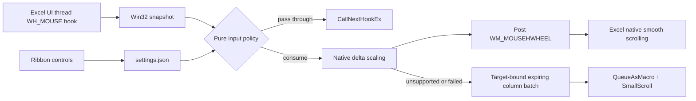

# Architecture

## Design goals

ExcelShiftScroll must alter only Shift + vertical-wheel input over an Excel worksheet, preserve every unrelated event, perform no slow work in a hook callback, and leave no process or hook after Excel exits.

## Components

- `Interop/NativeMethods` is the only P/Invoke boundary. It contains no policy.
- `Input/ExcelMouseHook` installs `WH_MOUSE` against the current Excel UI thread. The delegate is strongly referenced for the full hook lifetime. Callback exceptions pass the event through.
- `Input/WorksheetRegionDetector` requires the foreground and hit-tested windows to belong to the current process, share the same foreground root, and contain an `EXCEL7` ancestor. Unknown classes fail closed.
- `Input/InputDecisionEngine` is independent of Win32 and Excel COM. It accepts immutable snapshots, requires Shift alone, preserves every raw high-resolution delta for the smooth path, and also accumulates exact columns for fallback.
- `Excel/NativeHorizontalWheelDispatcher` scales the configured distance against Windows' horizontal-wheel character setting and asynchronously posts `WM_MOUSEHWHEEL` back to the worksheet target. Excel then owns pixel movement, animation, and pane behavior.
- `Excel/ScrollDispatcher` and `ExcelWindowScroller` remain the compatibility fallback. They coalesce fast events per original root HWND, queue at most one Excel macro, expire batches after 500 ms, and verify enabled state plus foreground/active-window HWND before `SmallScroll`. Settings changes and ineligible vertical input cancel pending batches. No workbook names or contents are read.
- `Settings` stores validated per-user JSON. Corrupt or unreadable data returns defaults; deserialization initializes missing fields. Saves use a bounded named-mutex wait, unique staging file, flush and atomic replacement. Save failure leaves in-memory state unchanged; concurrent processes use last-successful-whole-save semantics, without live reload.
- `Ribbon` exposes enabled state, column count, reversal, reset, and About status.
- `Diagnostics` writes privacy-limited JSON lines only when explicitly enabled. The hook callback never writes to disk.

## Event policy

The event is consumed only when all predicates are true:

1. hook code is `HC_ACTION` (0) and message is `WM_MOUSEWHEEL`, never `WM_MOUSEHWHEEL`; `HC_NOREMOVE` (3) and other codes pass unchanged, per [Microsoft MouseProc documentation](https://learn.microsoft.com/en-us/windows/win32/winmsg/mouseproc);
2. settings are enabled;
3. modifiers equal Shift exactly;
4. Excel's current process owns the foreground root;
5. the pointer hit resolves to the same foreground root;
6. the hit window ancestry contains the worksheet class.

Every eligible precision-wheel delta is consumed and converted immediately: wheel-up becomes a negative horizontal delta (left), and wheel-down becomes positive (right). Sub-unit scaling remainders are retained so small deltas are not lost. Separately, deltas accumulate to 120 only for the exact-column COM fallback. The reverse option negates both paths.

Native delivery clears the fallback accumulator because the native path already owns that delta. Target/settings changes reset precision remainders. The fallback validates [Window.Hwnd](https://learn.microsoft.com/en-us/office/vba/api/excel.window.hwnd) at execution; it deliberately drops uncertain input rather than scrolling a different active window. Already-posted native messages remain owned by Excel and are not recalled on pause. Animation quality still requires a physical-device visual test.

## Lifecycle and failure behavior

`IExcelAddIn.AutoOpen` constructs one service graph and installs one hook. Initialization is idempotent. `AutoClose` unhooks first and disposes pending dispatch. `HookLifetime` makes repeated install/dispose calls safe. An installation failure leaves the add-in loaded but inactive; input remains native and About reports the failure.

`PostMessage` prevents re-entering Excel inside the hook callback. Native `WM_MOUSEHWHEEL` messages pass through the hook unchanged, so conversion cannot recurse. If Windows reports zero/page horizontal scrolling or posting fails, Excel-DNA's macro queue waits until Excel is ready and performs the prior exact-column fallback. COM failures, modal states, and shutdown races are caught outside the hook and result in a dropped gesture rather than a hung or crashed Excel process.

## CPU, processes, and DPI

There is no polling, busy wait, timer owned by this project, keyboard hook, worker process, or service. Idle CPU usage is therefore event-driven and expected to be indistinguishable from zero. Win32 mouse points are screen-space physical coordinates and are passed directly to `WindowFromPoint`, avoiding custom DPI conversions. Multi-monitor handling relies on Win32's signed point fields.

## Known assumptions

`EXCEL7` is the documented-in-practice worksheet rendering class across supported desktop Excel releases, but Microsoft does not guarantee it as a public API. The implementation does not use it alone: process, foreground-root, hit-test, and ancestry checks are all required. If Microsoft changes the class, scrolling stops rather than expanding into unsafe UI. The development-only `tools/WindowProbe` can collect class-only evidence without window titles or workbook data.

See [ADR 0001](adr/0001-target-net48.md) and [ADR 0002](adr/0002-input-and-scroll-strategy.md).
